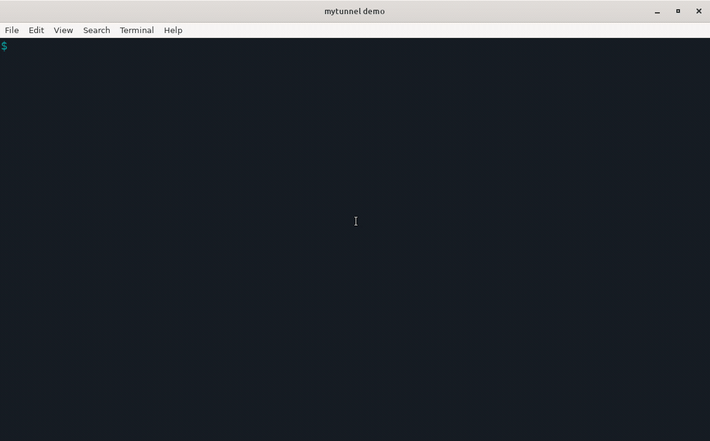
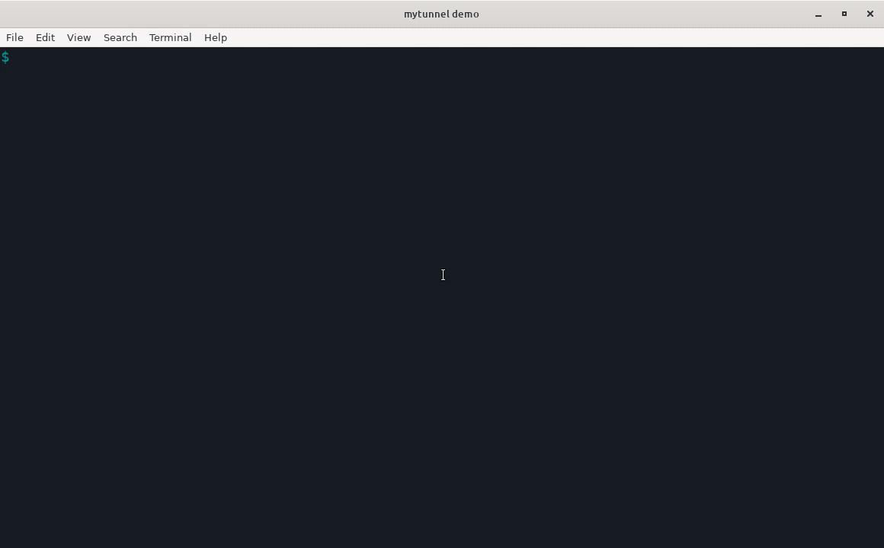
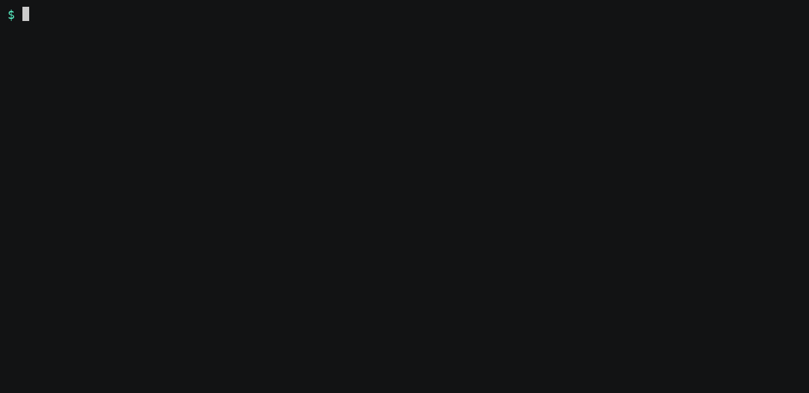
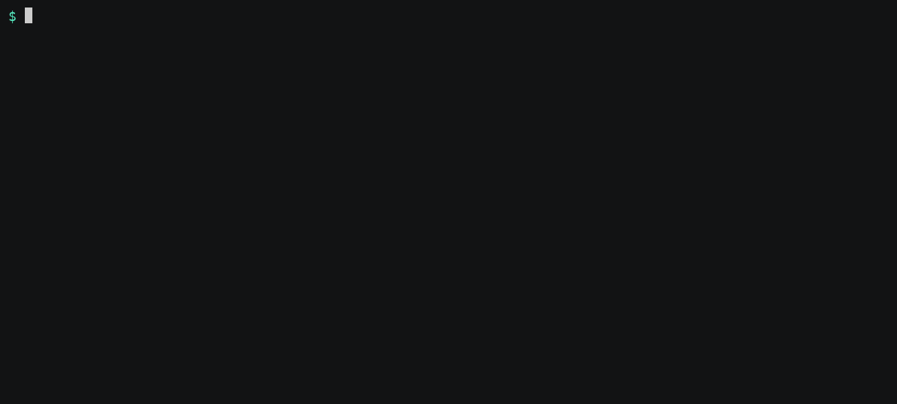
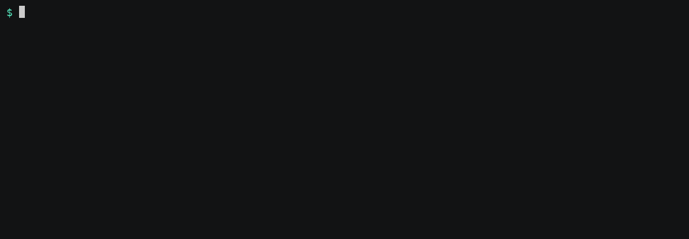
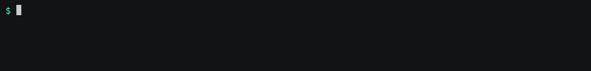
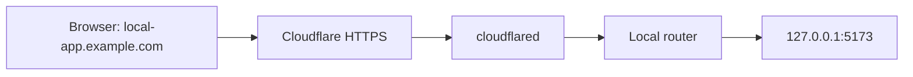

# mytunnel

TLDR: You know ngrok? This is your basic ngrok - free (except for a domain)

## Basic usage


Expose a local HTTP service on a subdomain of your own domain with one command.

```sh
mytunnel 5173 --subdomain local-app
# https://local-app.example.com → 127.0.0.1:5173
```

Keep the command running to keep the route available. Press Ctrl+C to remove it. Run another command with a different port and subdomain to expose another service. Omit `--subdomain` to generate a random name.

One computer shares one [Cloudflare Tunnel](https://developers.cloudflare.com/tunnel/) and a local router across all routes. A wildcard DNS record covers them all, so starting a route requires no DNS changes or Cloudflare API calls. Without a configured domain, the same command works at `http://local-app.localhost:43187` on your computer.

## Additional options

`--open`, `--copy`, `--qr`, and `--logs` work with both `mytunnel <port>` and `mytunnel up`. Combine them as needed.

```sh
mytunnel 5173 --subdomain local-app --open --copy --qr --logs
```

The recordings below use a running local demo app and a configured public domain.

### Open the browser with `--open`

Open the URL in your default browser. Public URLs open after mytunnel confirms that HTTPS reaches the active route. Local URLs open immediately.

```sh
mytunnel 5173 --subdomain local-app --open
```



### Copy the URL with `--copy`

Copy the URL to your clipboard at startup. With `up`, all URLs are copied once, one per line, in project-file order. Copying happens before public confirmation finishes.

```sh
mytunnel 5173 --subdomain local-app --copy
```



### Show a QR code with `--qr`

Print a QR code for each public URL to open it on your phone. No extra QR program is needed. Localhost URLs cannot be reached from a phone, so local mode prints an explanation instead.

```sh
mytunnel 5173 --subdomain local-app --qr
```



### Watch requests with `--logs`

See each completed request's route, method, path, status, and duration. Logs belong to the routes started by that command and omit query strings, headers, bodies, and readiness checks.

```sh
mytunnel 5173 --subdomain local-app --logs
```


### Start several services with `up`

Save your routes in `.mytunnel.json` in the project directory. Start the applications themselves first, then expose every route with one command.

```json
{
  "version": 1,
  "routes": [
    { "port": 5173, "subdomain": "local-app" },
    { "port": 8080, "subdomain": "api" }
  ]
}
```

```sh
mytunnel up
```



Ctrl+C removes this project's routes. Routes started by other commands stay active.

### Choose a project file with `--config`

Load a specific project file instead of `.mytunnel.json` in the current directory. Useful for keeping separate route sets for different projects or environments.

```sh
mytunnel up --config ./config/dev.mytunnel.json
```



### List active routes with `status`

Show routes owned by all running mytunnel commands on this computer, including their URLs and local ports.

```sh
mytunnel status
```



---

## Installation

### Download a binary

Download an archive and `checksums.txt` from the [latest release](https://github.com/Elethynh/mytunnel/releases/latest). The binary needs no Go runtime. Public tunnels also require `cloudflared`.

| System | Archive suffix |
| --- | --- |
| Linux, x86-64 | `linux_amd64.tar.gz` |
| Linux, ARM64 | `linux_arm64.tar.gz` |
| macOS, Intel | `darwin_amd64.tar.gz` |
| macOS, Apple Silicon | `darwin_arm64.tar.gz` |

Check the archive's SHA-256 against `checksums.txt` using `sha256sum` on Linux or `shasum -a 256` on macOS. For example, install the Linux x86-64 release with:

```sh
tar -xzf mytunnel_0.2.0_linux_amd64.tar.gz
mkdir -p "$HOME/.local/bin"
install -m 0755 mytunnel "$HOME/.local/bin/mytunnel"
```

Make sure `$HOME/.local/bin` is in your `PATH`. In zsh, run `rehash` if the new command is not found.

Each archive also contains `LICENSE`, `README.md`, and `THIRD_PARTY_NOTICES.md`.

### Install with Go

Go 1.22 or newer is required:

```sh
go install github.com/Elethynh/mytunnel@latest
```

The command is installed in `$(go env GOPATH)/bin`, unless you set `GOBIN`. Add that directory to your `PATH`.

### Build from source

```sh
git clone https://github.com/Elethynh/mytunnel.git
cd mytunnel
go build -o mytunnel .
```

### Try it before buying a domain

Run your HTTP application, then start a route:

```sh
mytunnel 5173 --subdomain local-app
# http://local-app.localhost:43187 → 127.0.0.1:5173
```

In another terminal:

```sh
mytunnel 8080 --subdomain api
# http://api.localhost:43187 → 127.0.0.1:8080
```

Omit `--subdomain` to generate a random name. `mytunnel status` lists active routes, and `mytunnel --version` prints the installed version.

Each command owns its route until Ctrl+C or a disconnected control session. Stopping one route leaves the others running. The shared daemon exits after the final route has been inactive for five seconds.

If your system does not resolve `*.localhost`, send the hostname explicitly:

```sh
curl -H 'Host: local-app.localhost' http://127.0.0.1:43187/
```

Local mode is accessible only on your computer.

### Set up public HTTPS with Cloudflare

This requires a domain, a Cloudflare account, and `cloudflared` on the computer serving your applications. The domain can be registered with Cloudflare or another registrar.

1. Add the domain to Cloudflare. If another registrar manages it, change its nameservers to those assigned by Cloudflare. Wait for the zone to become active and its Universal SSL certificate to be issued.
2. [Install cloudflared](https://developers.cloudflare.com/tunnel/downloads/), then create a locally managed tunnel:

   ```sh
   cloudflared tunnel login
   cloudflared tunnel create mytunnel
   ```

   Note the tunnel UUID and the path to its generated `<UUID>.json` credentials file.
3. Stop any active `mytunnel` commands, then configure the domain and tunnel:

   ```sh
   mytunnel configure \
     --domain example.com \
     --tunnel 6ff42ae2-765d-4adf-8112-31c55c1551ef \
     --credentials /absolute/path/to/6ff42ae2-765d-4adf-8112-31c55c1551ef.json
   ```

4. In Cloudflare DNS, create one **proxied CNAME** record: name `*`, target `<UUID>.cfargotunnel.com`. A specific DNS record takes precedence over the wildcard; remove a conflicting record if you want that hostname to reach the tunnel.
5. Start a route:

   ```sh
   mytunnel 5173 --subdomain local-app
   # https://local-app.example.com → 127.0.0.1:5173
   ```

The local route is registered and printed immediately. `cloudflared` may need a moment to connect to Cloudflare. For every public route, mytunnel concurrently retries a route-specific HTTPS readiness URL for up to 30 seconds. Confirmation requires valid TLS, the exact requested hostname, and the proof created for that route invocation. It does not call your application or certify application health. A timeout prints an actionable warning and keeps the route active.

Public HTTPS is available while your computer and CLI sessions are running. Once the tunnel stops, its DNS record remains.

The router supports HTTP and WebSocket connections, and routes use one subdomain label such as `local-app.example.com`. These public services have no additional authentication. Some development servers check the HTTP Host header; allow your chosen public hostname explicitly in the application's server settings.

### Sharing helpers and request logs

On macOS, `--open` uses `open` and `--copy` uses `pbcopy`. On Linux, opening uses `xdg-open`. Copying uses `wl-copy` in a Wayland session or `xclip` in an X11 session. These helpers are optional. A missing helper, QR error, or failed sharing action produces a warning and leaves the routes active.

Public QR codes are printed at registration, while public confirmation is pending. A public route that times out is not opened automatically by `--open`. Sharing flags never change the project file.

Request metadata is escaped for safe terminal output. Request events are never written to `daemon.log`. A streaming request appears after its stream ends, when its final status and duration are known. Bounded log queues prevent a slow terminal from delaying HTTP or WebSocket traffic. mytunnel warns when events are dropped.

### Project file rules

`mytunnel up` reads `.mytunnel.json` from the current directory without searching parent directories. `--config` selects an exact alternate path.

The version 1 schema accepts only `version` and `routes` at the top level, and only an explicit `port` and `subdomain` for every route. Unknown fields are rejected. The file does not contain credentials, domain setup, shell commands, or sharing preferences.

The complete file is validated before any route starts. If registration later fails, mytunnel reports the failed route and releases only the routes acquired by that `up` command. Routes owned by other commands remain active.

### How it works



The first CLI session starts the shared daemon and, in public mode, `cloudflared`. A private Unix socket registers routes and tracks their owning sessions. Requests are forwarded to the selected local port according to their hostname.

Settings and daemon logs live in `~/.config/mytunnel/`, or `$XDG_CONFIG_HOME/mytunnel/`. The settings file and control socket have mode `0600`, and their directory has mode `0700`. Tunnel configuration is generated from the settings when the daemon starts. `MYTUNNEL_HOME` overrides the settings directory for development and isolated tests.

The CLI and daemon negotiate feature support. If a newer CLI reports that the running daemon is from an older version, stop the active mytunnel commands you own and retry the new command. mytunnel does not forcibly kill the old daemon or unrelated sessions.

### Development and releases

```sh
go test -race ./...
go vet ./...
go build .
```

Tests cover first-time settings creation, strict project files and rollback, concurrent route ownership, public readiness, URL sharing, bounded request logs, HTTP streaming, and WebSocket upgrades. GitHub Actions runs the race-enabled suite on Linux and macOS with current Go, plus a separate test and build with Go 1.22 and `GOTOOLCHAIN=local`. A real public tunnel needs a configured Cloudflare account and domain to test end to end.

To build the four release archives and their SHA-256 checksums:

```sh
./scripts/package-release.sh v0.2.0
# dist/v0.2.0/
```

Pushing a version tag such as `v0.2.0` runs the release workflow, repeats the checks, and publishes the archives to GitHub Releases.

### License

[MIT](LICENSE).

Cloudflare documentation: [locally managed tunnels](https://developers.cloudflare.com/tunnel/features/locally-managed-tunnels/create-local-tunnel/), [ingress rules](https://developers.cloudflare.com/tunnel/features/locally-managed-tunnels/configuration-file/), [wildcard DNS](https://developers.cloudflare.com/dns/manage-dns-records/reference/wildcard-dns-records/), and [Universal SSL](https://developers.cloudflare.com/ssl/edge-certificates/universal-ssl/).
