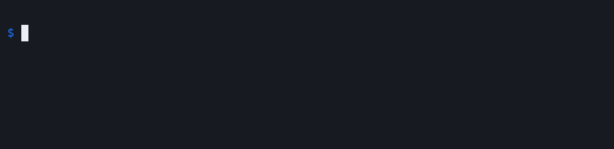
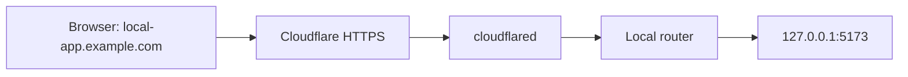

# mytunnel

TLDR: You know ngrok? This is your basic ngrok - free (except for a domain)



Expose local HTTP services on subdomains of your own domain with a small Go CLI and [Cloudflare Tunnel](https://developers.cloudflare.com/tunnel/).

```sh
mytunnel 5173 --subdomain local-app
# https://local-app.example.com → 127.0.0.1:5173
```

One computer runs one shared `cloudflared` process and a local router. Each CLI command adds a route, keeps it alive, and removes it when you press Ctrl+C. Start another command to serve another port. A single wildcard DNS record covers every route, so starting a service requires no DNS changes or Cloudflare API calls.

Without a configured domain, the same commands work locally at `http://local-app.localhost:43187`.

## Install

### Download a binary

Download an archive and `checksums.txt` from the [latest release](https://github.com/Elethynh/mytunnel/releases/latest). The binary needs no Go runtime. Public tunnels also require `cloudflared`.

| System | Archive suffix |
| --- | --- |
| Linux, x86-64 | `linux_amd64.tar.gz` |
| Linux, ARM64 | `linux_arm64.tar.gz` |
| macOS, Intel | `darwin_amd64.tar.gz` |
| macOS, Apple Silicon | `darwin_arm64.tar.gz` |

Check the archive's SHA-256 against `checksums.txt` using `sha256sum` on Linux or `shasum -a 256` on macOS. For example, install the Linux x86-64 release with:

```sh
tar -xzf mytunnel_0.1.0_linux_amd64.tar.gz
mkdir -p "$HOME/.local/bin"
install -m 0755 mytunnel "$HOME/.local/bin/mytunnel"
```

Make sure `$HOME/.local/bin` is in your `PATH`. In zsh, run `rehash` if the new command is not found.

### Install with Go

Go 1.22 or newer is required:

```sh
go install github.com/Elethynh/mytunnel@latest
```

The command is installed in `$(go env GOPATH)/bin`, unless you set `GOBIN`. Add that directory to your `PATH`.

### Build from source

```sh
git clone https://github.com/Elethynh/mytunnel.git
cd mytunnel
go build -o mytunnel .
```

## Try it before buying a domain

Run your HTTP application, then start a route:

```sh
mytunnel 5173 --subdomain local-app
# http://local-app.localhost:43187 → 127.0.0.1:5173
```

In another terminal:

```sh
mytunnel 8080 --subdomain api
# http://api.localhost:43187 → 127.0.0.1:8080
```

Omit `--subdomain` to generate a random name. `mytunnel status` lists active routes, and `mytunnel --version` prints the installed version.

Each command owns its route until Ctrl+C or a disconnected control session. Stopping one route leaves the others running. The shared daemon exits after the final route has been inactive for five seconds.

If your system does not resolve `*.localhost`, send the hostname explicitly:

```sh
curl -H 'Host: local-app.localhost' http://127.0.0.1:43187/
```

Local mode is accessible only on your computer.

## Set up public HTTPS

This requires a domain, a Cloudflare account, and `cloudflared` on the computer serving your applications. The domain can be registered with Cloudflare or another registrar.

1. Add the domain to Cloudflare. If another registrar manages it, change its nameservers to those assigned by Cloudflare. Wait for the zone to become active and its Universal SSL certificate to be issued.
2. [Install cloudflared](https://developers.cloudflare.com/tunnel/downloads/), then create a locally managed tunnel:

   ```sh
   cloudflared tunnel login
   cloudflared tunnel create mytunnel
   ```

   Note the tunnel UUID and the path to its generated `<UUID>.json` credentials file.
3. Stop any active `mytunnel` commands, then configure the domain and tunnel:

   ```sh
   mytunnel configure \
     --domain example.com \
     --tunnel 6ff42ae2-765d-4adf-8112-31c55c1551ef \
     --credentials /absolute/path/to/6ff42ae2-765d-4adf-8112-31c55c1551ef.json
   ```

4. In Cloudflare DNS, create one **proxied CNAME** record: name `*`, target `<UUID>.cfargotunnel.com`. A specific DNS record takes precedence over the wildcard; remove a conflicting record if you want that hostname to reach the tunnel.
5. Start a route:

   ```sh
   mytunnel 5173 --subdomain local-app
   # https://local-app.example.com → 127.0.0.1:5173
   ```

The local route is registered immediately. `cloudflared` may need a moment to connect to Cloudflare. Public HTTPS is available while your computer and CLI sessions are running. Once the tunnel stops, its DNS record remains.

The router supports HTTP and WebSocket connections, and routes use one subdomain label such as `local-app.example.com`. These public services have no additional authentication. Some development servers check the HTTP Host header; allow your chosen public hostname explicitly in the application's server settings.

## How it works



The first CLI session starts the shared daemon and, in public mode, `cloudflared`. A private Unix socket registers routes and tracks their owning sessions. Requests are forwarded to the selected local port according to their hostname.

Settings and daemon logs live in `~/.config/mytunnel/`, or `$XDG_CONFIG_HOME/mytunnel/`. The settings file and control socket have mode `0600`, and their directory has mode `0700`. Tunnel configuration is generated from the settings when the daemon starts. `MYTUNNEL_HOME` overrides the settings directory for development and isolated tests.

## Development and releases

```sh
go test -race ./...
go vet ./...
go build .
```

Tests cover first-time settings creation, validation, concurrent routes, session cleanup, public hostname routing, idle shutdown, and WebSocket upgrades. Tests run on Linux and macOS in GitHub Actions. A real public tunnel needs a configured Cloudflare account and domain to test end to end.

To build the four release archives and their SHA-256 checksums:

```sh
./scripts/package-release.sh v0.1.0
# dist/v0.1.0/
```

Pushing a version tag such as `v0.1.0` runs the release workflow, repeats the checks, and publishes the archives to GitHub Releases.

## License

[MIT](LICENSE).

Cloudflare documentation: [locally managed tunnels](https://developers.cloudflare.com/tunnel/features/locally-managed-tunnels/create-local-tunnel/), [ingress rules](https://developers.cloudflare.com/tunnel/features/locally-managed-tunnels/configuration-file/), [wildcard DNS](https://developers.cloudflare.com/dns/manage-dns-records/reference/wildcard-dns-records/), and [Universal SSL](https://developers.cloudflare.com/ssl/edge-certificates/universal-ssl/).
