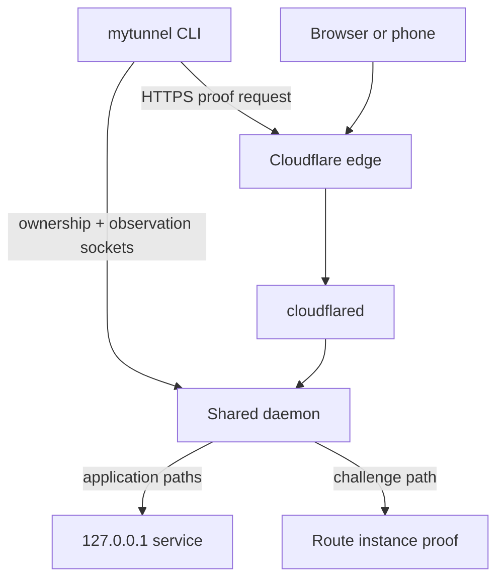
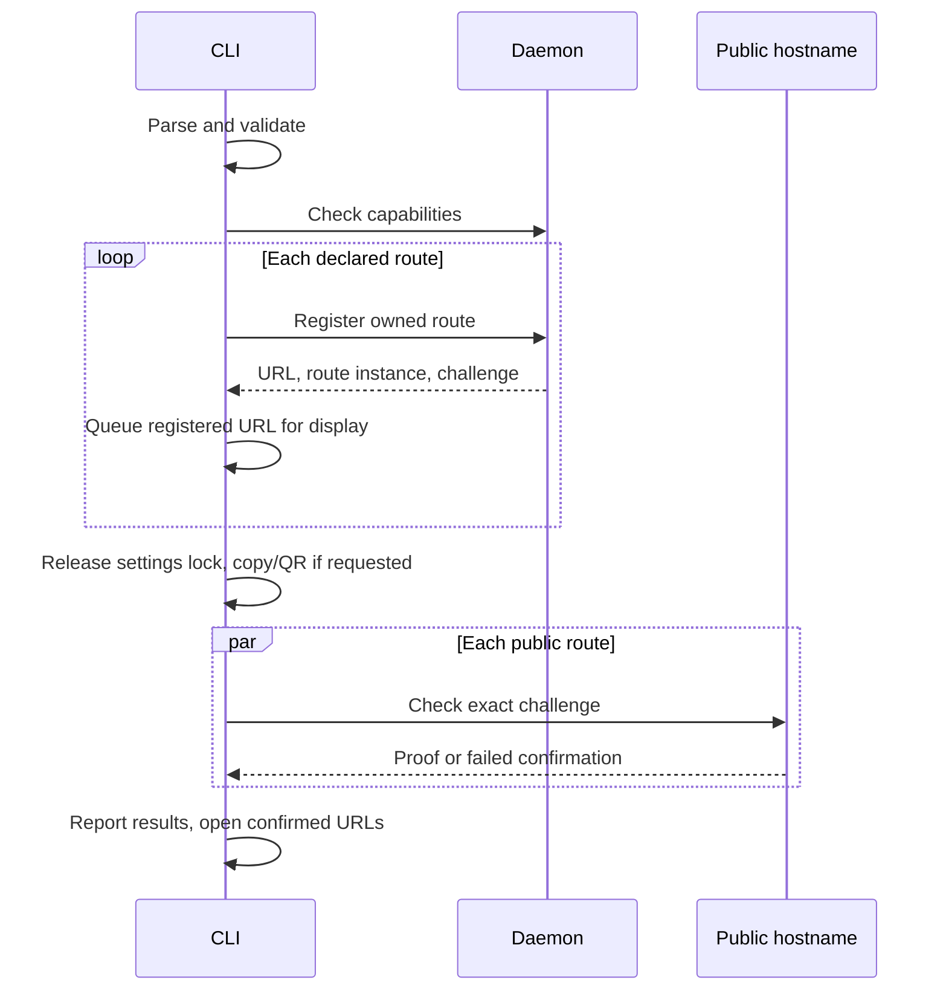
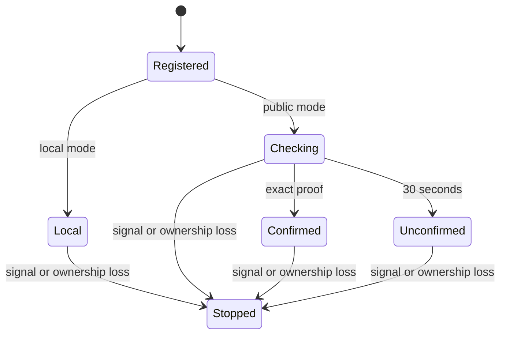

# mytunnel CLI Quality of Life - Plan

## Goal Capsule

- **Objective:** A developer can start a project's local services together, see whether their public addresses work, share those addresses, and inspect incoming requests from the terminal.
- **Means:** Extend the existing Go CLI, shared local router, and Cloudflare Tunnel (KTD1).
- **Authority:** Product Requirements define behavior. Key Technical Decisions define its implementation. Units and acceptance examples must preserve both.
- **Execution profile:** Implement in an isolated mytunnel worktree, in dependency order, with the Verification Contract as the completion gate.
- **Delivery:** The implementing developer or agent finishes the units and presents the verified change for review. Publishing a release or merging requires the user's subsequent instruction.
- **Stop conditions:** Surface a conflict with the requirements, a required change to public routing or credentials, or an inability to preserve HTTP/WebSocket behavior. Resolve routine implementation details within the plan.

---

## Product Contract

### Summary

Add the five selected improvements: browser and clipboard shortcuts, public URL readiness, project configuration, terminal request logs, and QR codes. Both a single-port command and a project command use the same route lifecycle.

### Problem Frame

Starting several services currently requires repeated commands. A printed URL confirms only local registration, so the developer must separately check public reachability, copy links, and find request information. These steps are repeated during development and phone testing.

### Requirements

**Existing behavior**

- R1. Preserve the current port-first command, random subdomains, local mode, `status`, `configure`, one-label host routing, incoming Host, HTTP streaming, and WebSockets.
- R2. Each command owns only the routes it creates. Ctrl+C/SIGTERM releases those routes successfully, and a lost ownership connection terminates that command with an error without stopping unrelated sessions.
- R3. Keep one shared cloudflared process and router per settings directory, the existing global settings format and permissions, and the Linux/macOS single-binary distribution.

**Project startup**

- R4. `mytunnel up` reads `.mytunnel.json` from the current directory and starts every declared route. `up --config <path>` selects a different file.
- R5. Validate the complete project before starting any route. A registration failure releases routes acquired by that invocation and reports the failed route.
- R6. The project file contains a schema version and explicit port/subdomain pairs. It contains no credentials, domain setup, shell commands, or presentation preferences.

**Readiness and sharing**

- R7. Print each registered URL immediately and distinguish local registration, public checking, public confirmation, and public confirmation timeout.
- R8. Public confirmation proves that the requested HTTPS hostname reaches that invocation's active router route. It does not certify application health or make requests to application endpoints.
- R9. Retry public confirmation for up to 30 seconds per route, concurrently for project routes. On timeout, show an actionable warning and keep the route running.
- R10. `--open` opens each route once after confirmation, or immediately in local mode. `--copy` copies the registered URLs once, in project order, separated by newlines.
- R11. `--qr` prints a labelled terminal QR for each registered public URL. In local mode, explain that the localhost URL is not reachable from a phone and retain the ordinary URL output.
- R12. Sharing flags are opt-in and combinable on both startup commands. Missing browser/clipboard helpers, QR failures, or a failed sharing action produce warnings while the routes stay active.

**Request inspection**

- R13. `--logs` displays requests only for this invocation's routes, with route label, HTTP method, path, status, and duration.
- R14. Log collection excludes query strings, headers, bodies, readiness probes, and credentials. Escape terminal controls in metadata, and never persist request events to the daemon log.
- R15. Request logging must preserve proxy behavior and remain bounded when the terminal is slow. Dropped log events are reported without delaying HTTP traffic or ending route ownership.

### Key Decisions

- Retain Go and the existing Cloudflare/local-router design. This is a personal tool for one computer with a few concurrent services. Governs R1, R2, R3. (session-settled: user-directed — chosen over another CLI language and a separately maintained tunnel server: one executable and no server administration.)

### Acceptance Examples

- AE1. **Covers R1, R7–R12.** Starting `mytunnel 5173 --subdomain local-app --open --copy --qr` prints the URL, copies it and prints its QR with a checking label, then opens the browser only after public confirmation.
- AE2. **Covers R4–R6, R2.** A project with ports 5173 and 8080 starts two routes. If the second name is already owned by another CLI, startup fails and releases the first new route while the existing owner continues.
- AE3. **Covers R8–R10.** A specific DNS record directs the hostname to Firebase and returns HTTP 200. mytunnel does not claim readiness or open that URL, warns after the checking window, and keeps its local registration.
- AE4. **Covers R2, R9.** Ctrl+C during registration or readiness checking cancels pending work and releases every acquired route without waiting for the 30-second window.
- AE5. **Covers R13–R15.** With logs enabled, HTTP, SSE, and WebSocket traffic retain their behavior. A slow consumer may lose log lines but does not slow a response or remove a route.

### Scope Boundaries

- Explicitly excluded by the user: `mytunnel doctor` and shell completion, formerly items 3 and 7.
- No dashboard, request replay, payload capture, persistent log store, background project supervisor, automatic service startup, or DNS/Firebase switching.
- No parent-directory config discovery or config hot reload. A named file and one startup command cover the selected project use case.
- Considered and not built: atomic visibility of all project routes. Sequential registration can briefly expose an earlier route before rollback. Reconsider if projects acquire a requirement for simultaneous publication.
- Considered and not built: continuous uptime monitoring, automatic tunnel restart, and application health checks. The selected feature confirms startup reachability; a later failure still uses the existing lifecycle and proxy errors.
- Considered and not built: zero-downtime replacement of an old daemon. Existing sessions can finish before the new CLI starts its daemon, per KTD3.
- Considered and not built: custom detection of repeated JSON object keys. Standard decoder semantics produce one effective value that is then validated and displayed. Reconsider if configuration later crosses a trust boundary.

---

## Planning Contract

### Assumptions

These defaults fill details the feature list did not specify:

- Project startup manages every listed route, in file order, and does not offer route selection in this change.
- Copy and QR expose an address even while confirmation is pending. Browser opening waits for confirmation because opening the wrong destination would mislead the user.
- Logs are opt-in through `--logs`. A QR encoder dependency is acceptable if the distributed executable still requires no runtime or external QR program.
- Global settings remain machine-specific. A project file is safe to commit because its allowed fields contain only route configuration.
- Readiness is a one-time check from the developer's machine. Cloudflare Access or another intermediary can prevent confirmation even when another browser can access the service.

### Key Technical Decisions

- KTD1. **Extend the current flat Go package.** Keep `main.go` as dispatch/orchestration and add focused root files for sessions, project configuration, readiness, sharing, and request events. Reuse `normalizeSubdomain`, `parsePort`, `routeURL`, and settings locking. This implements R1–R3 without adding a CLI framework or a second router.
- KTD2. **One ownership connection per route.** Both startup commands use a shared session runner. Install signal cancellation before acquisition, retain acquired sessions, release them on any startup error, and close the group on a later ownership disconnect. Queue each registered URL for display immediately after its acknowledgement, with project startup marked pending. Only after all registrations succeed may copy/QR actions or readiness begin. If registration later fails, report that the displayed group was rolled back. Hold the settings lock only while loading/registering, without waiting for terminal writes, then release it before readiness, helper actions, or log waiting. Sequential registration satisfies R2/R5/R7 without a batch protocol.
- KTD3. **Add capability discovery without migrating settings.** Advertise capabilities in authenticated status and registration responses. A new CLI checks required capabilities before registration and gives a restart-after-stopping-sessions message for an older daemon. Never kill another session to upgrade. New daemons still accept legacy registration/status requests and preserve their response fields. This makes R1–R3 explicit across mixed binary versions.
- KTD4. **Prove the full public route with a per-registration challenge.** Generate the path and expected response independently with `crypto/rand`, at least 128 bits each, and return them through private control. For a GET to the exact active Host and challenge path, the router serves status 200 and the proof with `Cache-Control: no-store`; it does not call the backend. Other paths retain existing routing. The CLI validates TLS, refuses redirects, bounds response reading, and requires status 200 with the exact complete proof. Retain standard environment proxy selection so proxy-required networks work. Use an overall 30-second context, a 3-second request timeout, and a one-second delay between attempts. Challenges remain valid only for that route instance and are excluded from logs. This meets R8 despite wildcard overrides or a wrong service returning 200. Cloudflared connector health alone cannot establish it.
- KTD5. **Keep project JSON small and strict.** Use schema version 1 and a nonempty ordered `routes` array. Require integer ports 1–65535 and normalized explicit subdomains, reject unknown fields, duplicate normalized names, missing fields, trailing data, and unsupported versions. Use standard `encoding/json` semantics for repeated object keys. Reusing a backend port under different subdomains is valid. Validate before global settings access. JSON needs no parser dependency and the version gives the new persisted format an evolution path (R4–R6).
- KTD6. **Use native helpers as optional capabilities.** Run macOS `open`/`pbcopy` and Linux `xdg-open` plus `wl-copy` in Wayland or `xclip -selection clipboard` in X11. Select Linux helpers only for an available graphical session. Pass URLs as arguments or stdin, never through a shell. Give helpers a two-second acknowledgement window and report exit failures. Preserve clipboard-owning background processes, reap the launched process asynchronously if it outlives that window, and do not start a competing fallback after a timeout. Avoid captured output pipes inherited by clipboard children. No automatic installations or OSC52 escape fallback. All user output is serialized so warnings, QRs, and request lines do not interleave (R10–R12). [xdg-open contract](https://portland.freedesktop.org/doc/xdg-open.html), [wl-copy ownership](https://github.com/bugaevc/wl-clipboard/blob/master/data/wl-clipboard.1).
- KTD7. **Embed only QR encoding.** Pin `github.com/skip2/go-qrcode` at `v0.0.0-20200617195104-da1b6568686e`. Use its provided compact text renderer, retain its quiet zone, choose medium error correction, and adapt only labels and terminal contrast. The module is MIT, declares Go 1.13, and has no module requirements. Its old, untagged version is a tradeoff accepted for a narrow encoder; newer libraries add scope or dependencies unnecessary here. Include its license in release archives. Verify scanability rather than assuming text output is sufficient (R11/R12). [Encoder API and version](https://pkg.go.dev/github.com/skip2/go-qrcode).
- KTD8. **Separate logging delivery from route ownership.** For `--logs`, open an authenticated observation connection bound to the acquired route instance. It never owns or prolongs the route. Observation setup follows acquisition and cannot delay R7's registered-URL output. Stream bounded newline JSON events with a retained buffered reader, including bytes read with the acknowledgement. Before enqueueing, copy only escaped, truncated metadata into a frame of at most 4096 bytes, including JSON escaping. Never retain request objects or references to the original unbounded path in queues; forwarding still uses the complete original request. Both daemon and CLI queues hold at most 128 bounded events and drop newest on overflow, reporting the count when delivery resumes. Use a bounded socket write; close only the observation connection if it stalls and warn in the CLI. No automatic resubscription. This separation ensures logging errors cannot trigger route deletion (R2, R13–R15).
- KTD9. **Observe proxy hooks without replacing ResponseWriter.** Track per-request metadata through request context. Capture the upstream status in `ReverseProxy.ModifyResponse` and 502 in the existing `ErrorHandler`. Emit one completion event in a defer around `ServeHTTP`, including when it unwinds with `http.ErrAbortHandler`; do not recover that panic. Duration measures the handler lifetime, so SSE and WebSocket events appear when the stream/session ends. Status means the final response selected by the proxy, not proof that the entire response reached the client. A failed upgrade may overwrite the initially observed 101 with 502. Preserve the existing transport, request forwarding, and error text. Avoiding a response-writer wrapper preserves Go's hijacking/flushing path (R1, R13–R15). [Go 1.22 reverse proxy source](https://github.com/golang/go/blob/go1.22.12/src/net/http/httputil/reverseproxy.go).

### High-Level Technical Design

**Topology.** Readiness travels through the same public hostname as normal traffic.



**Startup protocol.** KTD2–KTD4 determine ordering.



**Readiness state.** Timeout ends startup checking, not the session (R7–R9).



**Group lifetime.** Parse/validate → acquire sessions → run → release owned sessions. An acquisition error releases sessions acquired so far. A later ownership error releases the group. Neither path closes unrelated connections (KTD2).

**Event data flow.** Proxy hooks → compact bounded event → bounded per-observer queue → observation socket → bounded CLI display queue → serialized terminal output. Ownership reads and cancellation never wait for terminal writes (KTD8/KTD9).

**Flag behavior.**

| Input | Single route | Project routes | Local mode | Unconfirmed public URL |
| --- | --- | --- | --- | --- |
| Default | URL and readiness | Per-route URLs and readiness | Label local | Keep route and warn |
| `--open` | Open once when confirmed | Open each confirmed URL | Open immediately | Do not open |
| `--copy` | Copy URL once | Copy all in file order | Copy local URL | Copy with pending label |
| `--qr` | Print labelled QR | Print each in file order | Explain phone limitation | Print with pending label |
| `--logs` | Owned route requests | Prefix each with route | Supported | Log any traffic reaching router |

**Command and file contract.** Keep `mytunnel <port> [--subdomain name]` and add the four boolean flags shown above. Add `mytunnel up [--config path]` with the same flags. Do not reinterpret no-argument help or load project configuration for the port-first command.

```json
{
  "version": 1,
  "routes": [
    { "port": 5173, "subdomain": "local-app" },
    { "port": 8080, "subdomain": "api" }
  ]
}
```

### Risks and Implementation Notes

The public readiness check can be blocked by network policy or Cloudflare Access. Its timeout warning must say that reachability was not confirmed and suggest checking the hostname's DNS destination and `daemon.log`; it must not assert that a backend is down.

QR rendering needs validation on light and dark terminals. Use a clear light quiet zone and dark modules, then reset any explicitly selected colors. In redirected output, preserve the URL and provide plain QR text without cursor control. Final renderer details are an implementation choice constrained by scanner checks.

The event observer adds a second local protocol operation. Tokens stay on the private Unix socket and never enter URLs, log lines, project files, or helper arguments. The public proof is random response data, not a machine credential or an authentication mechanism.

An old CLI will continue to work with the new daemon. A new CLI encountering an old active daemon reports how to stop its sessions and retry. `status` remains usable for identifying those sessions.

---

## Implementation Units

### U1. Share route lifecycle and negotiate daemon capabilities

- **Goal:** Provide a cancellation-safe foundation for both startup commands and new protocol features.
- **Requirements:** R1–R3, R12, R15. Decisions KTD1–KTD3.
- **Files:** `main.go`, `config.go`, `control.go`, `daemon.go`, new `session.go`, `options.go`, `session_test.go`, `options_test.go`, and existing `main_test.go`.
- **Approach:** Keep configure parsing stable and add typed parsing for startup options. Extract acquisition/cleanup into one runner, make startup lock acquisition cancellable, add route instance identity and capability responses, and retain buffered readers for streaming operations.
- **Test scenarios:**
  - Existing port/subdomain invocations, help/status/configure, random names, and invalid options retain their behavior.
  - Boolean flags work in any order after the port or `up`; duplicates, unknown flags, and missing values fail before registration.
  - Cancellation during lock waiting, acquisition, and a later wait closes only acquired sessions and exits successfully.
  - An old-daemon fixture receives no feature registration and leaves existing routes active; old-client fixtures can still register/status against the new daemon.
  - A coalesced acknowledgement and next frame are both read exactly once, and limits apply per frame.
- **Verification:** Both command paths can use the runner without changing existing routing and cleanup tests. No long-lived settings lock remains.

### U2. Confirm public URL reachability

- **Goal:** Report actual public routing readiness and bounded failure while retaining active routes.
- **Requirements:** R7–R9, R1/R2. Decisions KTD2/KTD4. Depends on U1.
- **Files:** `daemon.go`, `control.go`, `session.go`, new `readiness.go`, `readiness_test.go`, and `main_test.go`.
- **Approach:** Generate route-scoped challenges, serve proof before proxying the exact challenge request, and run cancellable per-route probes after registration.
- **Test scenarios:**
  - A fake HTTPS endpoint returns the exact current proof after transient failures and causes one confirmed notification.
  - A required environment proxy can carry a valid proof when direct egress is unavailable, without weakening TLS or proof checks.
  - Covers AE3. Wrong proof with HTTP 200, redirect, invalid certificate, another Host, and an expired route instance never confirm readiness.
  - Covers AE4. Cancellation stops probes promptly and releases owned sessions.
  - The checking window expires with a warning while the registered route remains available.
  - Application GET/HEAD handlers receive no readiness traffic, and ordinary paths still reach the backend.
  - Two route probes run concurrently so project startup does not multiply the 30-second window.
- **Verification:** Deterministic tests use injected transport/clock seams. A later manual public-tunnel smoke confirms real DNS/TLS/routing without changing DNS.

### U3. Start project routes from JSON

- **Goal:** Make one project command manage a small set of services.
- **Requirements:** R2, R4–R6, R9. Decisions KTD2/KTD5. Depends on U1/U2.
- **Files:** `main.go`, `options.go`, `session.go`, new `project.go`, `project_test.go`, and `session_test.go`.
- **Approach:** Decode and validate the complete selected file, construct an ordered route list, then pass it to the shared runner. Include file and route context in errors.
- **Test scenarios:**
  - Covers AE2. A two-route file displays each registration immediately; a collision on route two rolls back only the new group and performs no copy/QR action.
  - Empty routes, invalid ports, normalized duplicate names, unknown fields, trailing JSON, and unsupported versions create no daemon or routes.
  - Default lookup stays in the current directory; `--config` selects a relative or absolute path without changing working directory.
  - Two names can target one backend port.
  - Ctrl+C and a lost ownership session close all routes owned by `up`, leaving a separately registered route serving.
- **Verification:** Project mode composes the same proven route runner and never writes project data into global settings.

### U4. Add browser, clipboard, and QR output

- **Goal:** Make registered addresses easy to open and share.
- **Requirements:** R10–R12. Decisions KTD6/KTD7. Depends on U2/U3.
- **Files:** `session.go`, new `sharing.go`, `sharing_test.go`, `qr.go`, `qr_test.go`, `go.mod`, new `go.sum`, and `THIRD_PARTY_NOTICES.md`.
- **Approach:** Centralize optional actions around the daemon-returned URLs. Execute helpers through a small injectable command boundary, encode QR locally, and serialize multi-route output.
- **Test scenarios:**
  - Covers AE1. Copy/QR run once after registration and open runs once after public proof.
  - Multi-route copy writes one newline-separated payload in file order; only confirmed routes open.
  - Helper selection respects macOS, Wayland, and X11; missing/failed helpers warn without ending sessions.
  - A clipboard helper exceeding its acknowledgement window does not delay readiness or cancellation, clear clipboard ownership, or trigger a competing fallback.
  - Helper arguments/stdin contain literal URLs and are never shell-evaluated.
  - QR output retains its quiet zone, encodes short and maximum supported URLs, and remains separate from log lines.
  - Local `--qr` explains the limitation; encoder failure leaves the URL and active route.
- **Verification:** Stubbed helpers establish invocation behavior. Manual desktop clipboard/browser checks and a real phone scan establish platform behavior that mocks cannot prove.

### U5. Stream request metadata without changing proxy behavior

- **Goal:** Show useful per-route HTTP traffic in the invoking terminal.
- **Requirements:** R1/R2, R13–R15. Decisions KTD8/KTD9. Depends on U1.
- **Files:** `daemon.go`, `control.go`, `session.go`, new `requestlog.go`, `requestlog_test.go`, and `main_test.go`.
- **Approach:** Bind observers to route instances, capture request metadata through proxy hooks, and send events independently of the ownership connection. Keep queues and frame sizes bounded on daemon and CLI sides.
- **Test scenarios:**
  - Normal responses, app errors, and unavailable backends report expected method/path/status and nonnegative duration.
  - Covers AE5. With logging enabled, bidirectional WebSocket echo works and emits one 101 event; SSE data flushes before the stream ends.
  - Informational responses do not replace the final status or produce extra completed-request events.
  - Query secrets, headers, bodies, proof traffic, and control characters never leak into terminal records.
  - A non-reading observer and a blocked terminal cause bounded dropping or observation shutdown while responses and ownership continue.
  - Large request paths remain intact at the backend while queued log frames and their owned metadata stay within the byte limit.
  - Invalid authentication is rejected; an observer ends when its exact route instance is removed and cannot follow a later reuse of the same name.
- **Verification:** Existing Host, 404/502, WebSocket, cleanup, and idle tests still pass with logging enabled and disabled. Race checks cover concurrent requests and teardown.

### U6. Document the combined workflow and verify distribution

- **Goal:** Ship understandable commands in the existing four binary packages.
- **Requirements:** R1–R15. Depends on U1–U5.
- **Files:** `README.md`, command help in `main.go`, `scripts/package-release.sh`, `.github/workflows/ci.yml`, and `THIRD_PARTY_NOTICES.md`.
- **Approach:** Add single-route/project examples, flag behavior, readiness limits, optional OS helper requirements, log semantics, and daemon upgrade instructions. Include third-party notices in archives and verify the declared Go 1.22 floor as well as current CI Go.
- **Test expectation:** No tests that merely assert documentation prose. Exercise the documented workflows and inspect generated archives.
- **Verification:** README stays English, retains the existing GIF, uses `local-app` in examples, and documents the phone restriction for local mode. All four archives contain notices and require no QR runtime program.

---

## Verification Contract

Run these gates during implementation, not during planning.

| Gate | Scope | Completion signal |
| --- | --- | --- |
| Formatting and vet | Changed Go files, `go vet ./...` | No formatting or vet findings |
| Automated regression | `go test -race ./...` on Linux/macOS | Existing and unit-specific behavior passes |
| Minimum Go version | Tests/build with Go 1.22 and automatic toolchain upgrade disabled | New dependency and APIs respect declared minimum |
| Build and packaging | Existing packaging script for Linux/macOS, amd64/arm64, CGO disabled | Four archives build and contain license notices |
| Local CLI smoke | Two backends, one `up`, one unrelated command, Ctrl+C | Correct routing and isolation during teardown |
| Public URL smoke | Existing configured domain and two fresh subdomains | Both confirm through HTTPS and browser opens after confirmation |
| Desktop sharing | macOS and available Linux desktop sessions | Clipboard paste and browser target match output |
| QR scan | Real phone, light/dark terminal, representative URL lengths | Camera decodes the exact intended public URL |
| Logging integration | HTTP, SSE, WebSocket, slow observer | Correct metadata, flushing, bidirectional traffic, and bounded queues |

Use fake HTTPS origins and isolated `MYTUNNEL_HOME` directories in automated tests. Do not require Cloudflare credentials or network access for CI. Keep Unix test sockets under a short temporary path for macOS.

Public smoke testing requires an existing working tunnel and unused hostnames. Do not change DNS records, global credentials, or stop unrelated sessions for verification. If a desktop OS or real phone is unavailable, report that validation gap explicitly and leave the release gate open.

---

## Definition of Done

All five selected improvements work through both applicable startup commands and satisfy R1–R15. Units have their named behavioral coverage, existing routing/lifecycle tests pass, and verification results distinguish automated evidence from manual checks.

No doctor command, completion files, DNS automation, or unrelated refactor is included. README and help agree with actual behavior. Release archives contain the QR library notice. The reviewed change is ready for the user's shipping decision.
